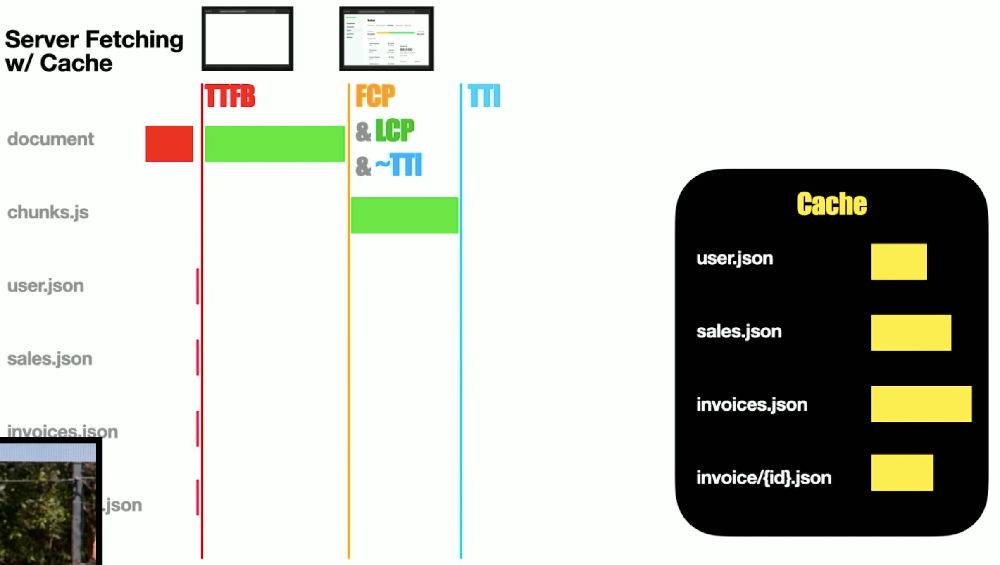

本文是 [When To Fetch: Remixing React Router - Ryan Florence][1] 这篇演讲的总结，演讲者 [Ryan Florence][2] 是 react-router 的 Co-Creator，Remix 的 Co-Founder，演讲介绍了 Remix 如何利用 react-router 的嵌套路由解决数据获取相关一系列问题，并带来最佳的首屏体验。

## Waterfalls

带来不好的用户体验的最快方式是在组件中获取数据，首先看以下这段很常见的代码有什么问题。

```js
function Root() {
  // 请求的发出 + 请求结果的读取
  const user = useFetch(url)
  return (
    <Layout>
      {user
        ? <Sales />
        : <Spinner /> // fallback 的渲染
      }
    </Layout>
  )
}
```

没错，Root 组件中 user 在未获取到时会渲染 Spinner 组件，Sales 组件无法渲染，Sales 组件中的请求无法发出，导致可以并行的请求被串行发出，也就是”请求瀑布“问题。

以上代码将请求的发出、请求结果的读取和 Root 组件的渲染耦合在一起，这也是 React 中一个很常见的 bad-pattern，被称为“[fetch-on-render（渲染之后获取数据）][3]”。

解决方法就是通过发出请求在组件渲染之前（initiate fetches before render）的方式让请求并行，将请求的发出、请求结果的读取和 fallback 的渲染解耦。

首先看下“fetch-then-render（读取到全部请求结果之后渲染）”的写法，将请求的发出尽可能的提前，尽早开始获取数据，解耦了请求的发出和请求结果的读取，但全部请求结果（user、sales）的读取都需要在 Root 中维护，随着复杂度的增高这种方法的缺点就会越加明显。

```js
// 请求的发出（initiate fetches）
const promise = fetchLoader()

function Root() {
  const [user, setUser] = useState(null)
  const [sales, setSales] = useState(null)

  // 请求结果的读取
  useEffect(() => {
    promise.then(data => {
      setUser(data.user)
      setSales(data.posts)
    })
  }, [])

  return (
    <Layout>
      {user
        ? <Sales data={sales} />
        : <Spinner /> // fallback 的渲染
      }
    </Layout>
  )
}
```

然后是“render-as-you-fetch（发送请求之后渲染）”的写法，有了 Suspense 我们不必等到全部请求都有结果后才开始渲染，在 sales 的请求还没有结果时 React 就会尝试渲染 Sales 组件，Sales 组件中对 sales 请求结果读取失败后会抛出一个 promise，告诉 React 渲染 fallback 组件。

```js
// 请求的发出（initiate fetches）
const resource = fetchLoader() // resouce 不是一个 promise，而是一个支持 Suspense 的特殊对象

function Root() {
  // user 请求结果的读取
  const user = resource.user.read()

  return (
    <Layout>
      <Suspense fallback={<Spinner />}> {/* fallback 的渲染 */}
        <Sales />
      </Suspense>
    </Layout>
  )
}

function Sales() {
  // sales 请求结果的读取
  const sales = resource.sales.read() // 当请求还没有结果时会抛出一个 promise
  return <SalesView data={sales} />
}
```

可以看出 Suspense 的作用仅仅是定义了当组件试图读取数据时，UI 可以回退到的 fallback 组件，如果想要请求并行，仍然需要将请求的发出提前。

> React 18 带来的 RSC（React Server Component）、Streaming、Suspense 并没有解决请求瀑布的问题。
>
> - Suspense defines where you need to await an already initiated fetch, pending UI, and when to "flush" the HTML when streaming.
> - React Server Components move data loading and rendering to the server.
> - Streaming renders React Server Components as data becomes available and sends HTML chunks at Suspense boundaries for the initial SSR.

## Nested Routes

嵌套路由（Nested routes）并不是 Remix 推出的新概念，react-router 很早就有了[嵌套路由][4]，通过 Route 组件嵌套在一起，内部的 Route 在外部 Route 的 Outlet 组件中渲染，此时这些 Route 的 URL path 也是嵌套起来的。


Remix 提出组件中的很多请求都仅依赖于 URL，通过将这些请求的发出提前，让这些请求并行，以解决请求瀑布的问题，如图中的组件的 loader。


对比前后的 Network，可以看出 LCP 和 TTI 都快了不少，同时减少了很多 Spinner 导致的 [CLS（Cumulative Layout Shift）][5]。


> 当然也有一些请求并不仅依赖于 URL，还依赖于 props，或者依赖于前一个请求的结果，这时就不能将这部分请求的发送提前了，做不到并行发送请求，此时使用 useFetch 仍然是不错的选择。

## SSR

能不能更快呢？当然可以。可以看出 4 个网络请求虽然已经是并行了，但是仍然被 document 和 chunk.js 的加载阻塞了，想要不被 document 和 chunk.js 的加载阻塞，就需要突破浏览器的限制，这 4 个请求仅依赖于 URL，而 Client 正是发送这些 URL 到 Server 的，所以可以在 Server 端就发送请求获取数据。

当然这时就需要依赖于 Server，仅 react-router 是做不到的，所以 Remix 提供了这些功能。


这时 FCP、LCP、TTI 都更快了，并且完全没有了 Spinner 导致的 CLS，但是 TTFB 却慢了很多，因为这时 Server 端的请求阻塞了 html 的生成，导致 TTFB 变慢。

解决这些请求的阻塞问题往往需要 cache，比如 SSG 在构建时提供缓存，通过 redis 提供缓存等。

当然引入 cache 也会导致请求结果的更新并不及时，开发者通常可根据页面的静态程度进行 SSG、ISR 等方案的选型。



## Streaming

但是当页面需要足够动态呢？又有足够快的 TTFB 呢？答案是 React 18 的流式渲染。


不仅 TTFB 没有被阻塞，而且有了 Suspense 的 fallback 带来了相比 SSR with Cache 更快的 FCP，只不过也因为这个 fallback 带来了 CLS。

Remix 提供的 `deferred API` 可以开启 Streaming 模式，并通过 `await` 让开发者控制页面中内容是直出还是渲染 fallback。

当组件的 loader 如下时，gists、pokemon、catfacts 的数据传给 deferred 一个 promise 时，表示全部使用 streaming 传输，这三个数据的展示在没有获取完所有数据时会显示 fallback 组件（Loading）。

```js
export const loader: LoaderFunction = async () => {
  const [gists, pokemon, catfacts] = [
    fetchGists(),
    fetchPokemon(),
    fetchCatfacts(),
  ]
  return deferred({ gists, pokemon, catfacts })
}
```
<p>
  <video autoplay loop src="/when_to_fetch/demo1.mp4">
    Sorry, your browser doesn't support embedded videos.
  </video>
</p>

当组件的 loader 如下时，pokemon 的数据比较重要，传给 deferred 是真正的结果而不是一个 promise 时，表示 pokemon 的数据会写到 SSR 生成的 html 上，而另外两个数据仍然使用 streaming 传输，pokemon 数据的展示会直出，没有 Loading，另外两个数据的展示在则会显示 Loading。

```js
export const loader: LoaderFunction = async () => {
  const [gists, pokemon, catfacts] = [
    fetchGists(),
    await fetchPokemon(),
    fetchCatfacts(),
  ]
  return deferred({ gists, pokemon, catfacts })
}
```

<p>
  <video autoplay loop src="/when_to_fetch/demo2.mp4">
    Sorry, your browser doesn't support embedded videos.
  </video>
</p>

而当使用 `Promise.all` 并行获取这三个数据时，就退化成了一般的 SSR 模式，这三个数据的结果都会写到 SSR 生成的 html 上，而展示时也都会直出不显示 Loading。

## Prefetching

Remix 还通过 Link 组件提供了页面的 [prefetching][6] 功能，在用户鼠标移动到 Link 组件上时去预取页面的所有请求，包括 CSS、图片等静态资源以及上文提到的组件的 loader，这样就可以抢先几百毫秒发出请求，提高响应速度。

实现原理也很简单，就是在触发 Link 的 mouse-enter 或 focus 事件时渲染 [PrefetchPageLinks 组件][7]，而 PrefetchPageLinks 组件中会带有 `<link rel="prefetch" href={href} {...linkProps} />`、`<link rel="modulepreload" href={href} {...linkProps} />` 等标签，渲染后浏览器会通过这些标签发出预取请求，之后用户真正点击进入页面时发出的请求就可以使用预取请求的结果了。

## Framework Agnostic

以上的这些优化并不仅存在于 React，请求瀑布在其他框架中也会出现，甚至 vanilla JS 中也会有，SSR 在几大框架中都有实现，Prefetching 仅仅是多渲染了几个标签，流式渲染的实现也依赖于现代浏览器。因此 Remix 团队也在[将 Remix 变得“Framework Agnostic”][8]，如今几大框架逐渐趋同，声明式 UI 深入人心，边缘计算逐渐兴起，探索新的解决问题方式和提供优秀的 UX、DX 或许比 benchmark 比拼更有价值，非常期待 Remix 的后续发展。

[1]: https://youtu.be/95B8mnhzoCM
[2]: https://github.com/ryanflorence
[3]: https://17.reactjs.org/docs/concurrent-mode-suspense.html
[4]: https://reactrouter.com/docs/en/v6/getting-started/tutorial#nested-routes
[5]: https://web.dev/i18n/zh/cls
[6]: https://remix.run/docs/en/v1/tutorials/jokes#prefetching
[7]: https://remix.run/docs/en/v1/api/remix#prefetchpagelinks-
[8]: https://remix.run/blog/remixing-react-router
